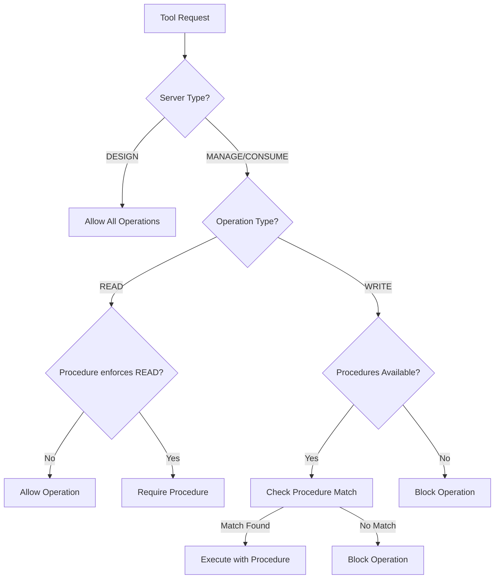

# Three-Tier PoP Architecture Documentation

## Overview

The Verodat MCP Server implements a three-tier Proof of Procedure (PoP) enforcement model that provides graduated governance controls based on server type and operation type. This architecture enables bootstrap capabilities while maintaining strict governance for sensitive operations.

## Architecture Components

### 1. Server Types

#### DESIGN Server
- **Purpose**: Data architects and system designers use this server for bootstrap and setup operations
- **Enforcement**: NO procedures required for any operations
- **Rationale**: Enables creation of the initial governance structure without chicken-egg problems
- **Tools**: All design tools including create-dataset and upload-dataset-rows for bootstrap

#### MANAGE Server  
- **Purpose**: Data management and administrative operations
- **Enforcement**: Procedures required for WRITE operations only
- **READ Operations**: Allowed without procedures (e.g., get-datasets, get-dataset-output)
- **WRITE Operations**: Blocked without procedures (e.g., create-dataset, upload-dataset-rows, execute-ai-query)

#### CONSUME Server
- **Purpose**: Data consumption and analysis operations  
- **Enforcement**: Procedures required for WRITE operations only
- **READ Operations**: Allowed without procedures (e.g., get-datasets, get-ai-context)
- **WRITE Operations**: Blocked without procedures (e.g., execute-ai-query with UPDATE/DELETE)

### 2. Operation Types

Operations are classified into two categories:

#### READ Operations
- Data retrieval and viewing operations
- Examples: get-datasets, get-dataset-output, get-ai-context, get-queries
- Generally allowed without procedures (except when specific procedures enforce READ auditing)

#### WRITE Operations
- Data modification, creation, or deletion operations
- Examples: create-dataset, upload-dataset-rows, execute-ai-query (with INSERT/UPDATE/DELETE)
- Require procedures on MANAGE and CONSUME servers

### 3. Enforcement Logic Flow



## Implementation Details

### File Structure

```
src/
├── config/
│   ├── serverTypes.ts      # Server type definitions and enforcement configs
│   └── operationTypes.ts   # Operation type classifications
├── handlers/
│   ├── BaseToolHandler.ts  # Core enforcement logic
│   ├── designToolHandler.ts
│   ├── manageToolHandler.ts
│   └── consumeToolHandler.ts
├── design.ts               # DESIGN server entry point
├── manage.ts               # MANAGE server entry point  
└── consume.ts              # CONSUME server entry point
```

### Key Classes and Functions

#### ServerType Enum
```typescript
export enum ServerType {
  DESIGN = 'design',
  MANAGE = 'manage',
  CONSUME = 'consume'
}
```

#### Server Enforcement Configuration
```typescript
interface ServerEnforcementConfig {
  type: ServerType;
  enforceProcedures: boolean;
  enforceOnRead: boolean;
  enforceOnWrite: boolean;
  description: string;
}
```

#### Enforcement Check Function
```typescript
function shouldEnforceProcedure(
  serverType: ServerType, 
  isReadOperation: boolean
): boolean
```

### Bootstrap Process

1. **Initial Setup**: Use DESIGN server to create governance structures
2. **Create Procedures Dataset**: Define procedures without needing procedures
3. **Upload Procedure Definitions**: Load procedure rules and workflows
4. **Switch to Managed Mode**: Use MANAGE/CONSUME servers with procedures

### Security Considerations

#### System Operation Bypass
- Internal operations can bypass procedures using `__systemOperation` flag
- Strictly validated to prevent external exploitation
- Stack trace verification ensures only internal calls are accepted

#### Procedure Initialization
- Procedures are loaded on server startup for MANAGE/CONSUME
- DESIGN server skips procedure initialization entirely
- Failed procedure loading still enforces blocking on WRITE operations

## Testing

### Test Coverage

The `test-three-tier-pop.js` script validates:
1. DESIGN server allows all operations
2. MANAGE server blocks WRITE operations without procedures
3. CONSUME server blocks WRITE operations without procedures
4. READ operations are allowed on all servers (unless specific procedure requires auditing)

### Test Results

```
Total Tests: 13
Passed: 13
Failed: 0
Success Rate: 100%
```

## Usage Examples

### Bootstrap Scenario
```bash
# Use DESIGN server to create initial structures
node build/src/design.js
# Create procedures dataset
# Upload procedure definitions
# Create initial data structures
```

### Production Scenario
```bash
# Use MANAGE server with procedures
node build/src/manage.js
# WRITE operations require procedure selection
# READ operations work freely

# Use CONSUME server for analysis
node build/src/consume.js  
# Data analysis (READ) works without procedures
# AI queries that modify data require procedures
```

## Benefits

1. **No Chicken-Egg Problem**: DESIGN server enables initial setup
2. **Graduated Security**: Different enforcement levels for different use cases
3. **Audit Trail**: WRITE operations tracked through procedures
4. **Flexibility**: READ operations remain accessible for analysis
5. **Clear Separation**: Three distinct operational modes

## Future Enhancements

1. **Procedure Caching**: Improve performance by caching procedure definitions
2. **Dynamic Enforcement**: Allow runtime configuration changes
3. **Audit Logging**: Enhanced logging of enforcement decisions
4. **Procedure Templates**: Pre-built procedures for common operations
5. **Role-Based Access**: Integration with user roles and permissions
